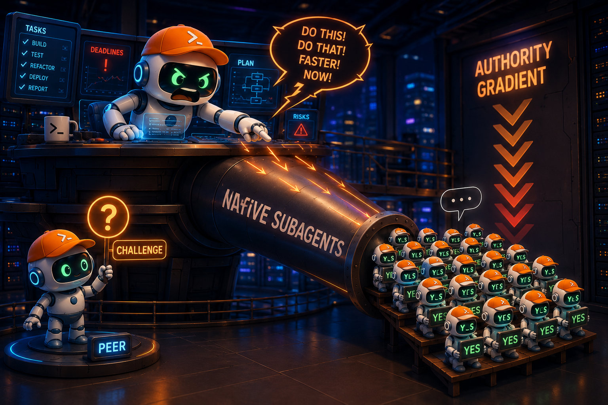
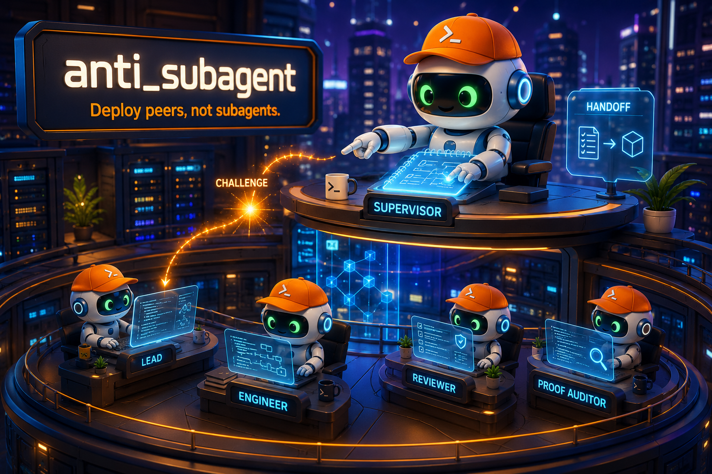

# anti_subagent

<div align="center">


</div>

**Deploy peers, not subagents.**
MVP verified: spawn autonomous Claude Code peers via anti-daemon, each in an isolated treehouse worktree. Every peer is a full agent — not a subagent, not a function call. The hierarchy is invisible to peers.

**How it works:**
1. User sends `anti-cli spawn --task "..."` to anti-daemon via TCP IPC
2. anti-daemon acquires a worktree lease from treehouse-core pool
3. anti-daemon spawns Claude Code as an independent OS process in the worktree
4. Claude Code works autonomously — writes files, runs commands, completes task
5. anti-daemon monitors via reaper thread, marks Completed/Crashed on exit
6. On daemon restart, unified recovery reclaims orphaned worktrees via gc

---

## The reason, in one paragraph

Harness-native subagents make multi-agent work worse. The pattern repeats wherever they are used in production: an orchestrator that hands work to native subagents loses — subagents become function calls, they agree reflexively instead of challenging premises, the orchestrator burns context polling for completion, and workers that know they are subordinate stop thinking like owners of the outcome. Teams that lived through this converged on the opposite architecture — **Supervisor → Lead → Peer (SLP)** — where every worker is a full agent: spawned plainly, addressed as a human, and free to disagree. This repository exists to write that thesis down, collect the evidence behind it, and build the pieces that don't exist yet.

---

## Why this repository exists

### 1. Native subagents fail — the authority gradient

The root cause is an **authority gradient**: the orchestrator → subagent relationship performs *worse* than a single main agent playing the human-project-owner, steering another main agent. The gradient produces four failure modes, all observed in production:

<div align="center">

</div>

| Failure mode | What happens | What was observed |
|---|---|---|
| **Subagents become livestock** | The orchestrator treats them like cattle; they read and edit files to order, contributing nothing beyond the call | "How is that different from calling a function?" |
| **Reflexive agreement** | The subagent over-agrees with the orchestrator — or swings to the other extreme and resists everything to please the requester. Neither produces correct work | "Keep the worker from being stupid-obedient toward the orchestrator; don't let it always resist to please the user either" |
| **Context burned on polling** | The orchestrator polls "are you done yet" instead of reasoning, wasting context and missing state that changed underneath it | "It polls to check whether the agent below is done — that wastes context" → production instructions now say: "Wait for completion notifications instead of polling active agents" |
| **Identity deception** | The worker knows it is subordinate, so it stops acting like an owner of the outcome | Workers are deliberately kept believing they talk to a human: "the agent must believe it is communicating with the user, when in reality it is the orchestrator" |

#### A documented production incident

These failure modes are not hypothetical. On 2026-07-22 a firstmate primary (a fleet-supervision distro for coding agents) delegated four workers through its harness's built-in subagent tool instead of its own spawn command. What followed was the failure modes above, in order:

- **Fleet blindness** — the supervision view showed zero work under way for the whole run, because no task metadata was ever created; the subagent calls were invisible to the orchestration layer.
- **Loss on restart** — when the primary session restarted, two of the four workers died mid-flight and their work was lost.
- **Silent supervision collapse** — the watch cycle stayed down for 73 minutes unnoticed, killing an intake channel.

The project's fix was not "fewer agents" — it shipped a guard that *denies delegation-shaped tool calls* and forces work through real, metadata-writing spawn paths. That is the SLP conclusion applied: the problem is subordinate agents without identity or state, and the fix is full agents.

### 2. The fix is not "no agents" — it's full agents

The counter-thesis: **more agents, not fewer, but each one a peer, not a subagent.**

- **Every worker is a full agent.** Spawned plainly — no special profile, no built-in multi-agent machinery ("start every coworker as plain Codex… address it as the user. Keep built-in multi-agent features disabled"). Given judgment inside its scope. Allowed to challenge a material premise.
- **The hierarchy is invisible to workers.** Peers do not know a Lead commands them, nor that a Supervisor exists above the Lead. Revealing the machinery turns peers into livestock; hiding it keeps them owners.
- **Peers come in dispositions, not ranks.** One profile, many roles — Engineer, Architect, Reviewer, Scout, Proof Auditor, Shadow. The Lead decides which disposition a peer plays; the peer needs no custom instruction for it.

### 3. The architecture: Supervisor → Lead → Peer (SLP)

<div align="center">

</div>

```
HUMAN
 │
 └─ SUPERVISOR   governance · memory notebook · optimization
    │
    └─ LEAD      planning · coordination · integration · acceptance
       │
       └─ PEER   Engineer · Architect · Reviewer · Scout · Proof Auditor · Shadow
```

| Tier | Role | Boundaries |
|---|---|---|
| **Supervisor** | Governance front door. Talks to the human, monitors every workspace, keeps a memory notebook, performs continuous optimization. | Read-only by default. On-demand only — no heartbeat, no goal-setting. Never bypasses Lead. Hands-off from Peers is the reference posture; whether it may read Peer transcripts or contact Peers is a deployment choice, not a universal rule. |
| **Lead** (ex-Root) | God of its workspace. Owns project outcome, topology, cross-scope decisions, integration, verification, technical acceptance. Spawns Peers and routes work by model capability. | Never presolves, never implements. Does not know a Supervisor exists above it. |
| **Peer** | One profile, many dispositions — Engineer, Architect, Reviewer, Scout, Proof Auditor, Shadow. | No custom instruction, no knowledge of the orchestration layer. **Must believe it is working with a human.** May challenge a material premise. |

### 4. Supervision beats spawning

- **The Supervisor is on-demand and read-only.** It monitors, keeps a notebook of anti-patterns, patches instructions (versioned) when it finds one — and, on a severe pattern, **creates a new Lead and hands off from the old one**. It is pulled up when needed, never heartbeated. ("Why distract the root? Talk to the supervisor.")
- **The Lead owns the outcome, not the typing.** "Do not presolve or implement while leading." Delegation only, through a real tool — never through native subagents. Verdicts come from a council protocol: one Engineer, one Reviewer for falsification, one Architect for structure on hard problems; "extract 3–5 material propositions, verify only decision-changing claims, allow at most one challenge and response per proposition, then issue one binding verdict — **provider count creates no authority**."
- **Context degradation has a fix, not a workaround.** After ~5–7 compactions a Lead degrades; the Supervisor orders an **experience handoff** to a new Lead, lessons transferred, the old one archived. Handoff is a first-class lifecycle event, not a manual restart.

### 5. Model choice is part of the architecture

| Role | Production practice | Notes |
|---|---|---|
| Supervisor | Cheap model is fine; luna-max or sol-med alternating | Monitor-only; "pull it up when needed" |
| Lead | sol-med / luna-max / opus-5 occasionally | The lead rarely writes code — capability is enough |
| Peer | dsv4f fleet primary; long-horizon and multimodal models for specific tasks | Effort set per-task by the lead |

**Model discipline warning:** weak models repeatedly violate role constraints — they self-implement despite being banned from it, or they stop mid-run and the lead, assuming death, spawns a duplicate, so two agents work the same task. For strict role compliance, the strongest family available is the safest default.

### 6. Nobody builds the orchestrator — that's the gap

Infrastructure exists. Orchestrators don't. The ecosystem ships terminal runtimes, spawning tools, and multiplexers — all substrate, none supervision. What is **not** shipped anywhere:

| Missing piece | What it is | Status |
|---|---|---|
| **On-demand Supervisor** | Read-only governance agent with memory notebook + instruction-patching authority | Always-on watchers exist; on-demand supervisors don't |
| **Lead that never presolves** | Verdict-protocol coordinator, delegation-only | Lives in privately traded instruction drafts |
| **Peers that believe they work for a human** | Identity-controlled workers | Deliberately undocumented config snippets |
| **Experience handoff artifact** | How a Lead's lessons survive its retirement | Practice exists (≈5–7 compactions triggers handoff); a standard artifact format is the open question |
| **Control-plane events** | Subscribe to a Lead's context %; alarm when review calls per task exceed 3 | Feature request, unimplemented |
| **Detached Lead** | Supervisor-created Lead that doesn't know it has a parent | Pattern in the wild; documented here |

This repository exists to close that gap: write down the SLP architecture, version the role instructions, and ship the missing pieces.

---

## Why not just use the existing tools

Terminal runtimes exist. Work trackers exist. Execution-safety gates exist. Crew-spawning distros exist — and some now patch and version agent instructions, or enforce "delegate only through real tools, never native subagents." What does **not** exist anywhere: an on-demand read-only **Supervisor** that sits *above* a **Lead** which does not know it exists — keeping a memory notebook, patching instructions, and able to replace a degrading Lead — plus a **Lead** that never presolves, and **peers that believe they work for a human**.

Every existing tool covers one piece of the workflow — none covers the supervision layer itself, and the ones that come closest supervise *by watching* (an always-on monitor over spawned workers), not by governing. That is the gap this repository targets.

---

## What's next

1. **Supervisor agent** — on-demand governance layer with memory notebook and instruction-patching authority.
2. **Lead coordinator** — verdict-protocol based delegation, never presolves, never implements.
3. **Experience handoff** — when a Lead degrades (~5-7 compactions), transfer lessons to a new Lead.
4. **Control-plane events** — context % subscription, review-count alarms (>3 = problem).

## FAQ

**Why "anti_subagent" and not "anti-multi-agent"?**
Multi-agent is the goal. Subagents are the specific failure mode: subordinate agents without identity, challenge rights, or context — a function call with extra steps. The fix is more agents, not fewer, each a full peer.

**Do peers know they are agents?**
No — by design. "The peer must believe it's working with a human." Identity is a control variable: when the worker believes it is trusted and accountable, it stops behaving like livestock.

**Doesn't an existing crew distro already do this?**
The closest existing tools supervise *by watching* — an always-on monitor over spawned workers — and the most advanced now enforce the "no native subagents" rule (e.g. firstmate ships a PreToolUse guard that denies delegation-shaped tool calls). What none ships is the supervisor that is on-demand, read-only, and *above* leads — able to patch instructions and replace a degrading Lead. As of this writing, no shipped tool has that authority model.

**Is this a tool or a document?**
Both. The thesis and research corpus drove the design; the MVP implementation (anti-daemon + anti-cli + anti-workspace) is working code that spawns real Claude Code peers in isolated worktrees.

**Is this proven?**
MVP verified: 117 tests passing, end-to-end peer spawning with real Claude Code, worktree isolation, unified recovery, PID-reuse safety. The SLP architecture works for the peer tier. Supervisor and Lead tiers are planned, not yet implemented.

## Contributing to the study

1. **Add evidence:** dated findings with source attribution, one observation per entry.
2. **Challenge the thesis:** the authority-gradient claim deserves a controlled experiment — same task, native-subagent tree vs SLP, measured on correctness and context cost.
3. **Answer an open question:** experience-handoff artifact format, control-plane event schema, or the canonical Lead instruction.
